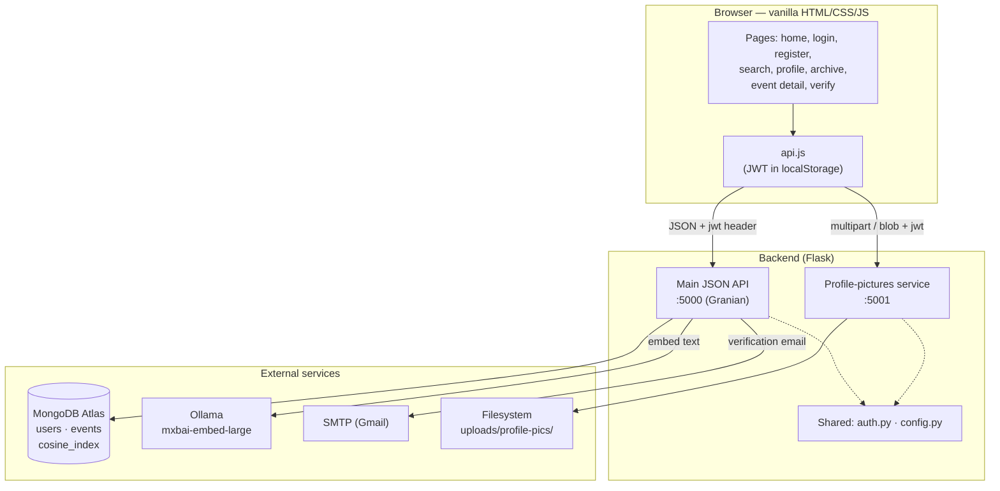
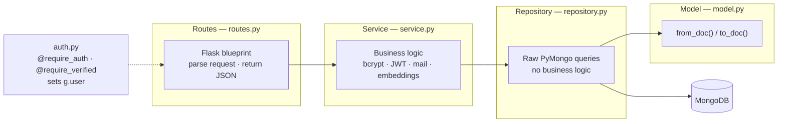
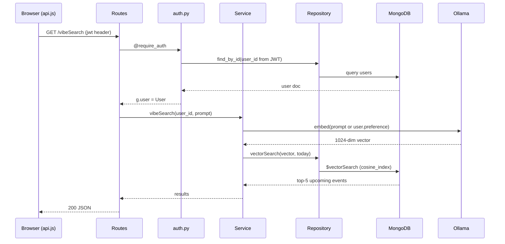
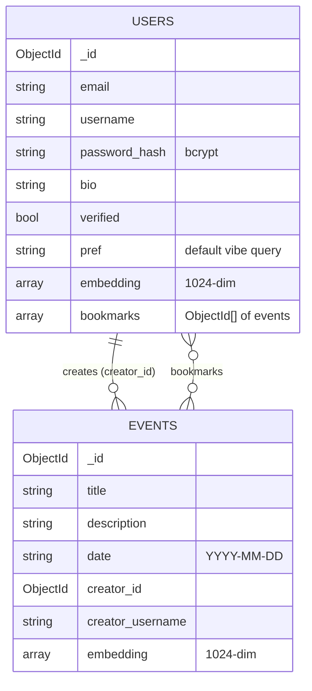
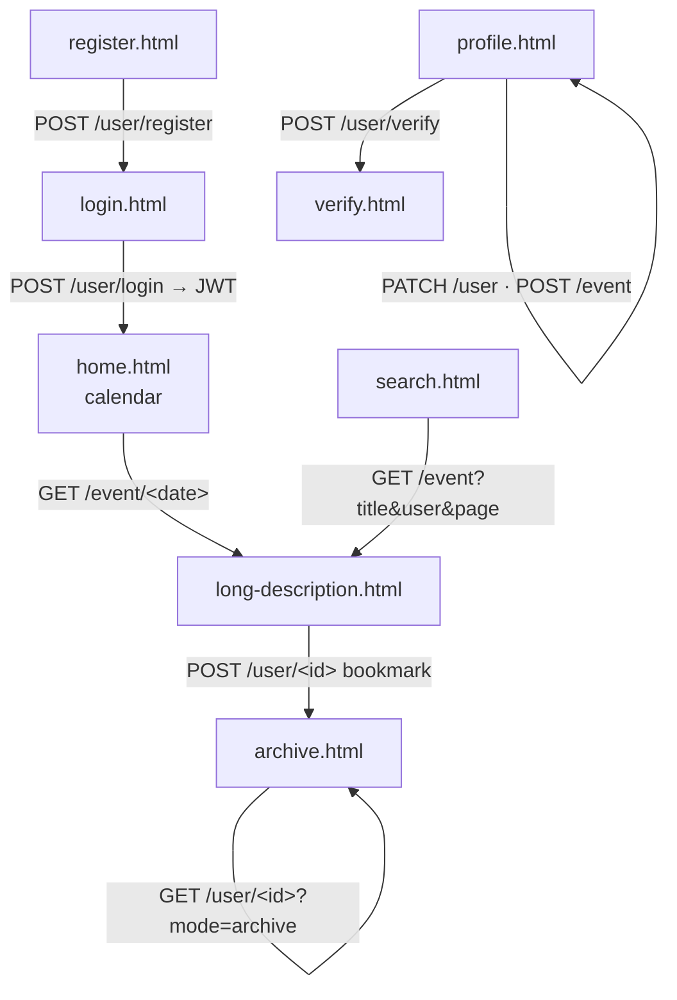
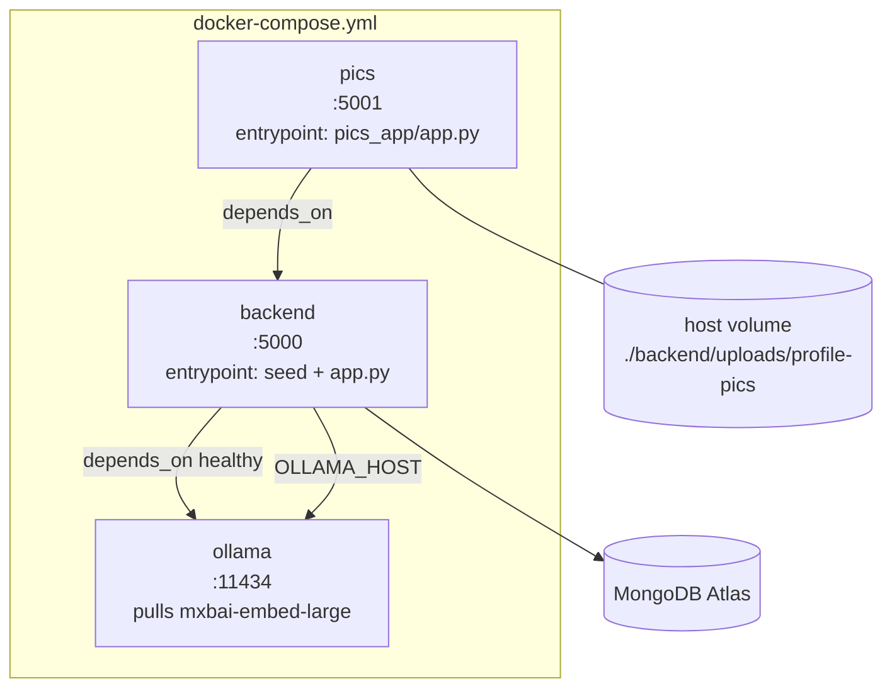

# Architecture

TUES Event Calendar is a web app for publishing and discovering school events at TUES. Verified users can post events; any registered user can browse, search, bookmark, and get semantic ("vibe") recommendations. This document describes the system architecture and the technologies used.

## Technology stack

| Area | Technology |
|---|---|
| Web framework | Flask 3.1 (Python 3.12) |
| WSGI server | Granian (5 blocking threads) |
| API docs | Flasgger / Swagger UI driven by an OpenAPI 3.0.3 spec |
| CORS | Flask-CORS |
| Database | MongoDB (Atlas — uses `$vectorSearch` and full-text `$search`) via PyMongo |
| Auth | Stateless JWT (PyJWT, HS256) |
| Password hashing | bcrypt |
| Embeddings | Ollama running `mxbai-embed-large` (1024-dim) |
| Image handling | Pillow (validation only, no re-encoding) |
| Mail | SMTP (Gmail) for manual verification requests |
| Frontend | Vanilla HTML / CSS / JavaScript — no frameworks, no build step |
| Containerization | Docker Compose (ollama + backend + pics services) |
| Seeding | Node.js script (`seed.js`) using `mongodb` + `bcryptjs` |

## System overview

Two independent Flask apps share the same auth and config. The main JSON API serves all business logic on port 5000; a separate profile-pictures service handles multipart image uploads on port 5001 so large files never block the JSON API. Both trust the same JWTs.

## Layered backend

Each entity (`users`, `events`) is a Python package with four layers. Dependencies flow one way: routes → service → repository → model. 

`auth.py` is shared infrastructure. `@require_auth` decodes the JWT, loads the `User` from the DB, and sets `g.user` (a `User` object, not a dict). `@require_verified` must always be stacked **below** `@require_auth` and returns 403 if the account is not verified. To avoid circular imports at module load, `auth.py` imports `users.repository` lazily inside the decorator.

## Request flow

Example: an authenticated request to the main API, showing how the layers and external services cooperate.

## Data model

MongoDB holds two collections. Events carry a 1024-dim embedding (matching `mxbai-embed-large`) used by the Atlas vector index. Bookmarks are stored as an array of event ids on the user. Dates are stored as `YYYY-MM-DD` strings so lexicographic comparison works for sorting and `>= today` filtering.

The Atlas `$vectorSearch` index `cosine_index` is created on startup by `initDB.py`: vector field `embedding` (1024 dims, cosine similarity) plus `date` and `user_id` as filter fields. `initDB.py` also creates the full-text Atlas Search index `event_search` (type `search`) mapping `description` and `creator_username` as strings — this powers the Search page. The `date >= today` constraint for search is applied with a `$match` stage after `$search`, so `date` is not part of that index.

## API endpoints

`endpoints/endpoints.yaml` is the OpenAPI 3.0.3 source of truth; `app.py` loads it at startup to power the Swagger UI at `/apidocs/`.

| Method | Path | Auth | Verified | Purpose |
|---|---|---|---|---|
| POST | `/user/register` | — | — | Create account |
| POST | `/user/login` | — | — | Log in, return JWT |
| POST | `/user/verify` | ✓ | — | Email admins to request verification |
| PATCH | `/user` | ✓ | — | Update email / username / bio / preference |
| GET | `/user/<userid>` | ✓ | — | `?mode=profile` or `?mode=archive` |
| POST | `/user/<userid>` | ✓ | — | Add / remove a bookmark |
| GET | `/event/<id>` | ✓ | — | Date (`YYYY-MM-DD`) → list; ObjectId → detail |
| GET | `/event/month/<year>/<month>` | ✓ | — | Dates in a month that have ≥1 event (HOME calendar) |
| GET | `/event` | ✓ | — | Full-text `$search` on description, `creator_username` filter, relevance-ranked, paginated (10/page) |
| POST | `/event` | ✓ | ✓ | Create an event |
| GET | `/vibeSearch` | ✓ | — | Top-5 semantically similar upcoming events |
| POST | `/pic` | ✓ | — | Upload own profile picture (≤5 MB) *(port 5001)* |
| GET | `/pic/<userid>` | ✓ | — | Serve a profile picture *(port 5001)* |

Two endpoints are deliberately dual-purpose: `GET /event/<id>` branches on whether `id` looks like a date or an ObjectId, and `GET /user/<userid>` branches on the `mode` query param.

## Profile-pictures service

A separate Flask app on port 5001, sharing `auth.py` and `config.py` with the main API so JWTs are trusted across both. Storage is filesystem-only at `uploads/profile-pics/<user_id>.<ext>` — there is no DB field; the serve route globs `<user_id>.*` to discover the extension. Pillow only validates that bytes are JPEG/PNG/GIF and enforces the 10 MB cap; the original bytes are written unchanged, so animated GIFs are preserved frame-for-frame. Upload identity comes from the JWT (no `<userid>` in the `POST /pic` path), so users cannot upload on someone else's behalf. Because `` cannot send headers, the frontend fetches pictures as a blob with the `jwt` header and renders them via `URL.createObjectURL`.

## Frontend

Vanilla HTML/CSS/JS with no framework, no bundler, and no Jinja — all dynamic content is built with the DOM API. Pages are split across contributor folders (`Philip/`, `Kristian/`, `Marti/`, `Nikola/`), with a shared design system (primary blue `rgb(65,160,255)`, card borders, box shadow, system font stack). `Philip/api.js` is the shared client: it stores the JWT in `localStorage`, auto-injects the `jwt` header on every request (`apiFetch`, `apiFetchBlob`, `apiUpload`), decodes the JWT to read the current user id, and redirects to login on a missing/invalid token or any 401.

## Deployment (Docker Compose)

Three services. `ollama` pulls and serves the embedding model and gates the backend behind a healthcheck. `backend` builds from `backend/Dockerfile`, seeds the database via `seed.js`, then starts the main API. `pics` reuses the same image with a different entrypoint and bind-mounts the uploads directory so pictures persist on the host.

Required environment (`.env`): `MONGO_URI`, `MONGO_DB`, `JWT_SECRET`; `OLLAMA_HOST` for embeddings; and the `MAIL_*` / `ADMIN_EMAIL` vars for the verification email. Verification itself is manual — `/user/verify` emails the admins, who then set `verified: true` directly in MongoDB; there is no admin endpoint.
